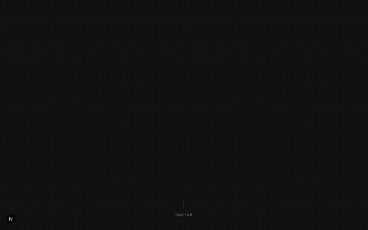
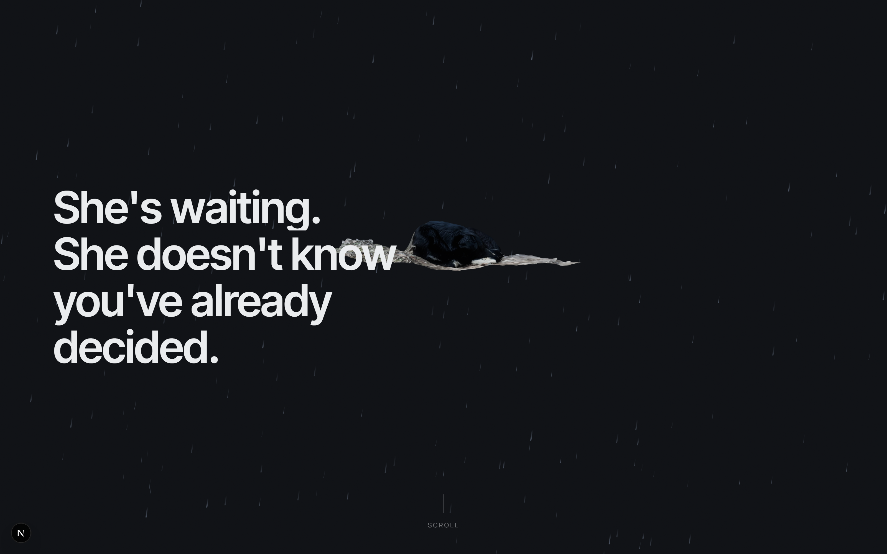
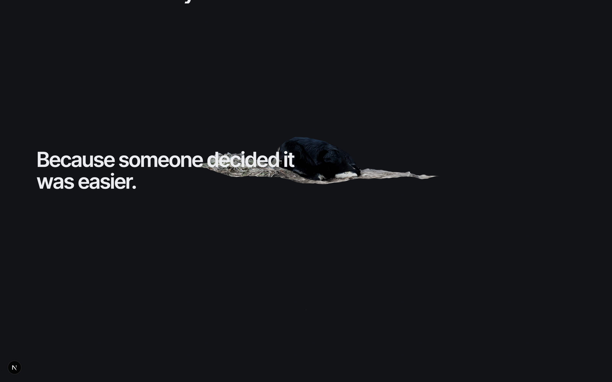
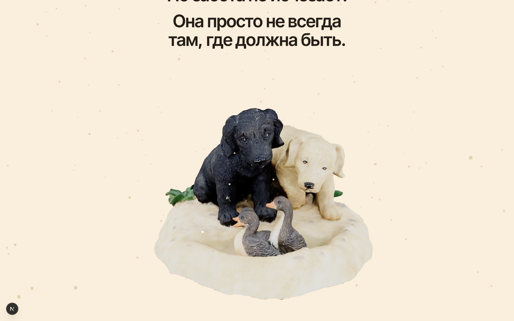
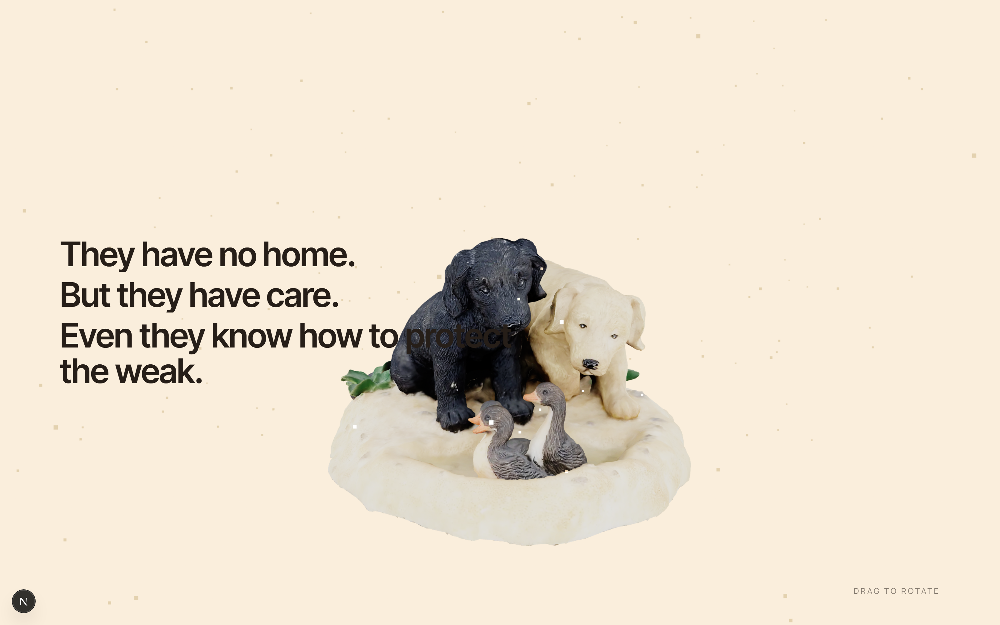
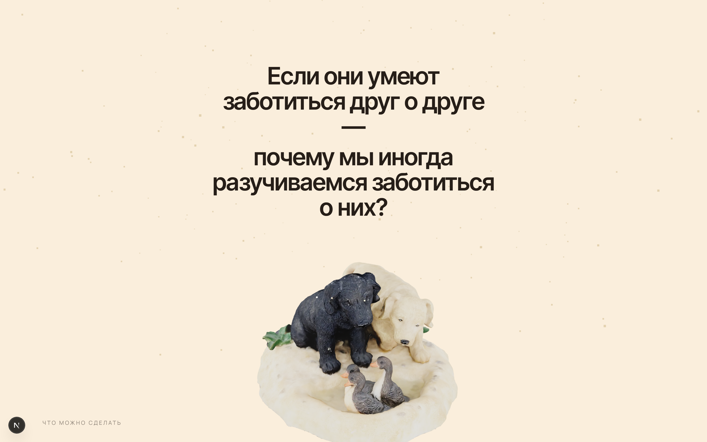
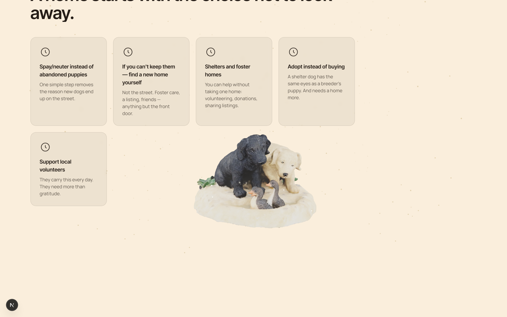
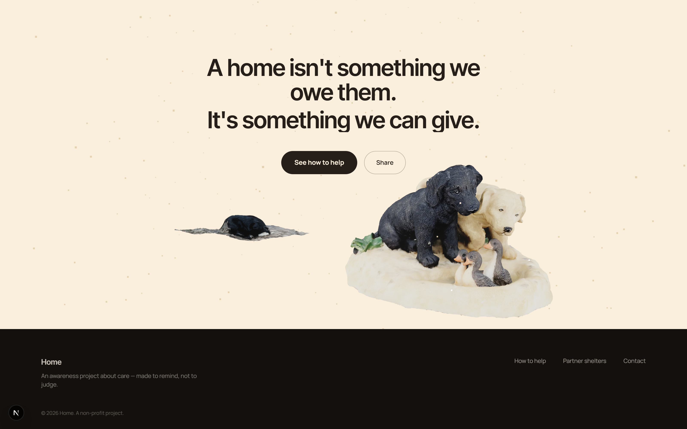

# Home

Image film / awareness scroll landing about abandoned dogs. Show, don't
pressure with facts: even homeless dogs are capable of caring for the weak —
so why does that care sometimes go missing in those who have a home?

> This is the showcase repo: video, screenshots, and description. The
> project's code lives in a separate private repository.

🔗 **Live page:** https://tranqww.github.io/save-dogs-showcase/

## Concept

The scroll is a journey from cold to warm. First scene: a lone dog in the
rain, graphite and steel tones, a light grain/noise — asphalt in the rain.
As you scroll, the palette, light, and scene "warm up" into a home — and a
second model takes over: two dogs gently watching over a chick.

Core idea:

> If even those without a home are capable of care — why is it sometimes
> missing in those who have one?

Structure — 8 sections: hero → fact → turning point (pinned, background
color bleeds through) → care scene (pinned, interactive 3D model with
drag-to-rotate) → question → practical block (what you can do) → final call
to action → footer.

## Screenshots

| | |
|---|---|
|  |  |
|  |  |
|  |  |

## Stack

- **Next.js 16** (App Router, TypeScript, Turbopack)
- **React Three Fiber** + **drei** — rendering and loading 3D models (`.glb`, Sketchfab)
- **GSAP** (`ScrollTrigger`, `SplitText`) — syncing camera, light, and text to scroll
- **Tailwind CSS v4** — base styles on top of a custom design system (CSS variables)
- Models compressed via `@gltf-transform/cli` (meshopt geometry + WebP textures):
  one file shrunk from 19.9MB to 1.0MB with no visible loss in the 3D viewport

One persistent WebGL scene runs the whole site — camera, light, the crossfade
between the two models, and particles (rain → warm dust) are all driven by a
single "director" that reads the current section's scroll progress every
frame.

## Links

- Live page: [tranqww.github.io/save-dogs-showcase](https://tranqww.github.io/save-dogs-showcase/)
- Code: [tranqww/save-dogs-landing](https://github.com/tranqww/save-dogs-landing) (private repository)
